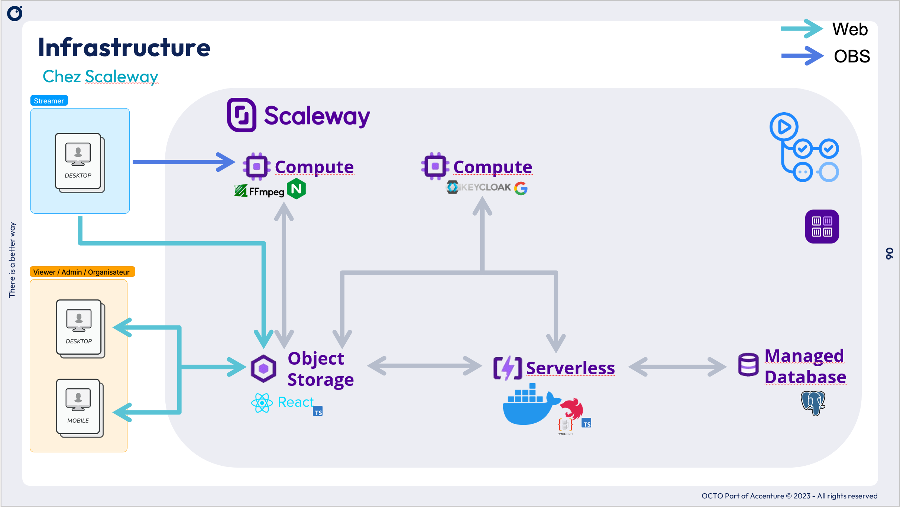
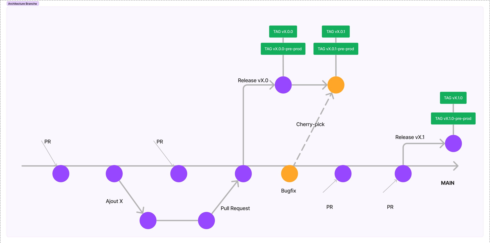
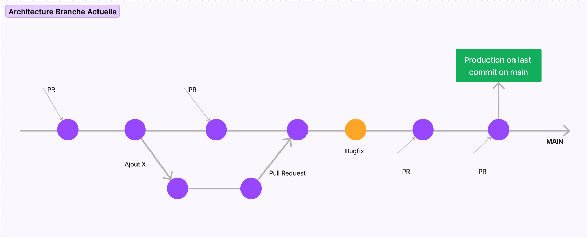
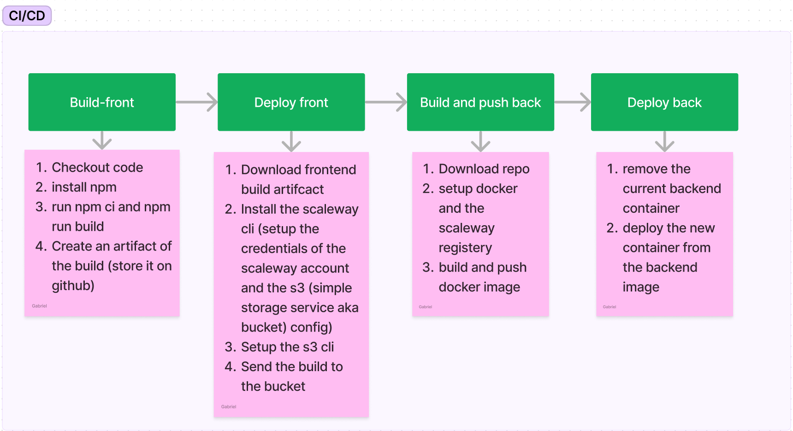

# Introduction

Ochocast est une application de streaming multicanal dédiée aux événements en direct ou en différé. Elle se compose de deux volets techniques principaux :

- La partie "stockage vidéo", qui permet de gérer, héberger et diffuser des contenus enregistrés.
- La partie "streaming en direct", prévue pour une future version, qui permettra de gérer des flux live.

## Origine du projet

Ochocast est né dans le cadre d’un projet pédagogique de la filière SIGL (Systèmes d’Information et Génie logiciel) de l’EPITA. Il s’inscrit dans une démarche d’expérimentation et de collaboration entre étudiants, encadrants et professionnels.

Ce projet a été initié en lien avec le PAE (Projet d’Approfondissement et d’Expérimentation), un format pédagogique de l’EPITA visant à confronter les étudiants à des problématiques concrètes d’entreprise.

## Octo : un sponsor engagé

Octo Technology soutient ce projet dans le cadre de son engagement en faveur de l’Open Source, du partage de connaissances et de l’innovation technologique. L’entreprise a fourni du mentorat, de la relecture technique, et des retours d’expérience terrain tout au long du développement.

## Une philosophie Open Source

Ochocast est conçu comme une application libre et ouverte, afin de :

- Ne pas être au cœur du métier d'Octo, ce qui rend son développement externe plus pertinent et évite d’avoir à le garder en interne.
- Contribuer à la communauté Open Source, apportant ainsi une valeur ajoutée partagée et un esprit collaboratif.
- Bénéficier de l’esprit communautaire, avec moins de bugs et de failles grâce à des revues de code (PR externes) qui garantissent une qualité continue de l’application.

Ce dépôt Git et cette documentation visent à transmettre la mémoire du projet, faciliter sa maintenance, et permettre son évolution dans le temps.

## Installation

Veuillez consulter cette [page](./02-installation.md) pour faire vos premiers pas et contribuer au projet.

## Infrastructure Scaleway

## Frontend

OchoCast est un site web statique stocké dans un Object Storage, permettant de servir le front-end via le CDN (Content Delivery Network) de Scaleway.

En savoir plus à ce sujet [ici](./02-tools/01-Front-end.md).

## Backend

OchoCast est une application Docker en TypeScript qui fonctionne en mode serverless. La dernière image est stockée dans le registre Scaleway et est écrasée à chaque déploiement.

En savoir plus à ce sujet [ici](./02-tools/02-Backend-Architecture.md).

## Base de données

OchoCast utilise une DB PostgreSQL gérée par Scaleway, exposé sur Internet et protégé uniquement par mot de passe (en raison de l'impossibilité de connecter un service serverless et une base de données gérée sur un réseau privé chez Scaleway).

En savoir plus à ce sujet [ici](./02-tools/03-stockage-s3.md).

## Streaming vidéo & Authentification

Des instances de calcul standard sont nécessaires, car plusieurs ports sont utilisés (ce qui n'est pas possible en mode serverless).

En savoir plus sur l'authentification [ici](./02-tools/04-Authentification.md).

En savoir plus sur le streaming vidéo :
- Consultez le [fichier](./03-tutorial-extras/03-rtmpServer.md) pour le serveur RTMP
- Consultez le [fichier](./03-tutorial-extras/04-WebSocketServer.md) pour le serveur WebSocket

# Branches

Diagramme de notre flux Git basé sur le tronc (idéal).

Actuellement, il n'y a pas de branches de release. La branche principale est déployée à chaque commit.

# CI/CD

En savoir plus à ce sujet [ici](./02-tools/05-CI-CD.md).
