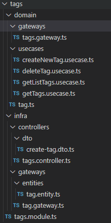

# Documentation de la structure en diamant du backend

## Introduction
Ce document décrit l'organisation du backend en suivant une architecture en diamant. Cette structure permet une séparation claire des responsabilités et une meilleure maintenabilité du code.

## Structure du projet
Le projet est organisé en plusieurs dossiers principaux :

### 1. `domain/`
Ce dossier contient la logique métier de l'application, divisée en deux sous-parties :
- **`gateways/`** : Définit les interfaces qui décrivent les interactions avec l'infrastructure sous-jacente.
- **`usecases/`** : Contient les cas d'utilisation qui encapsulent la logique métier.

#### Fichiers clés :
- `tags.gateway.ts` : Interface définissant les méthodes de manipulation des tags.
- `createNewTag.usecase.ts` : Cas d'utilisation pour la création d'un tag.
- `deleteTag.usecase.ts` : Cas d'utilisation pour la suppression d'un tag.
- `getListTags.usecase.ts` : Cas d'utilisation pour obtenir une liste de tags.
- `getTags.usecase.ts` : Cas d'utilisation pour récupérer un tag spécifique.
- `tag.ts` : Définit l'entité métier des tags.

---

### 2. `infra/`
Ce dossier contient l'implémentation concrète des interfaces définies dans `domain/` ainsi que la gestion des interactions externes.

#### Sous-dossiers :
- **`controllers/`** : Gère les requêtes entrantes et invoque les cas d'utilisation appropriés.
  - `tags.controller.ts` : Contrôleur pour la gestion des tags.
  - `dto/` : Contient les objets de transfert de données (DTOs) utilisés dans les requêtes et réponses.
    - `create-tag.dto.ts` : DTO pour la création d'un tag.

- **`gateways/`** : Contient les implémentations des interfaces définies dans `domain/gateways/`.
  - `entities/` : Définit les modèles de données et leurs interactions avec la base de données.
    - `tag.entity.ts` : Modèle de données représentant un tag.
  - `tag.gateway.ts` : Implémentation concrète du gateway pour les tags.

---

### 3. `tags.module.ts`
Ce fichier regroupe et exporte les différents éléments liés aux tags sous forme d'un module pour être utilisé dans l'application.

## Exemple: ajout de la modification
Pour ajouter un nouveau usecase permettant de modifier un tag, voici les étapes à suivre :

### 1. Ajouter le usecase dans `domain/usecases/`
Créer un fichier `updateTag.usecase.ts` et implémenter la logique métier de modification d'un tag.

### 2. Modifier le gateway dans `domain/gateways/`
Ajouter une méthode `updateTag` dans `tags.gateway.ts` pour définir l'interface de mise à jour.

### 3. Implémenter la mise à jour dans `infra/gateways/`
Dans `tag.gateway.ts`, ajouter l'implémentation de la méthode `updateTag` pour interagir avec la base de données.

### 4. Ajouter un DTO dans `infra/controllers/dto/`
Créer un fichier `update-tag.dto.ts` pour définir le format des données reçues pour la modification.

### 5. Modifier le contrôleur dans `infra/controllers/`
Dans `tags.controller.ts`, ajouter un nouvel endpoint `PUT /tags/:id` qui reçoit les données du DTO et appelle le usecase de mise à jour.

### 6. Mise à jour du module
Dans `tags.module.ts`, enregistrer le nouveau usecase et le rendre disponible pour l'application.

## Conclusion
L'architecture en diamant offre une séparation stricte entre la logique métier (`domain`) et l'infrastructure (`infra`).
- **Les cas d'utilisation** manipulent uniquement les entités et les gateways abstraits.
- **Les implémentations concrètes** se trouvent dans `infra`.
- **Les contrôleurs** orchestrent les interactions entre l'API et la logique métier.